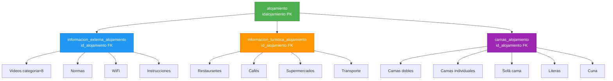

# Estructura de la Base de Datos - Alojamiento

## Diagrama de Relaciones



## Tablas Principales

### 1. `alojamiento` (Tabla Principal)
- **Primary Key**: `idalojamiento`
- **Campos principales**:
  - `nombre` - Nombre del alojamiento
  - `id_cerradura_raixer` - ID de cerradura inteligente
  - `informacion_portal` - Información del portal
  - `informacion_casa` - Información de la casa
  - `foto_anfitrion` - Foto del anfitrión

### 2. `informacion_externa_alojamiento` (Información Externa)
- **Foreign Key**: `id_alojamiento` → `alojamiento.idalojamiento`
- **Campos principales**:
  - `nombre` - Nombre del item
  - `descripcion` - Descripción detallada
  - `categoria` - Categoría (8 = videos)
  - `sensible` - Si es información sensible
  - `orden` - Orden de visualización

### 3. `informacion_turistica_alojamiento` (Guía Local)
- **Foreign Key**: `id_alojamiento` → `alojamiento.idalojamiento`
- **Campos principales**:
  - `nombre` - Categoría (Restaurantes, Cafés, etc.)
  - `descripcion` - Descripción del lugar
  - `icono` - Icono emoji

### 4. `camas_alojamiento` (Disponibilidad de Camas)
- **Foreign Key**: `id_alojamiento` → `alojamiento.idalojamiento`
- **Campos principales**:
  - `camas_dobles` - Número de camas dobles
  - `camas_individuales` - Número de camas individuales
  - `sofa_cama` - Número de sofás cama
  - `literas` - Número de literas
  - `cuna` - Disponibilidad de cuna (boolean)

## Proceso de Duplicación

El script de duplicación sigue estos pasos:

1. **Duplica el alojamiento principal**
   - Copia todos los campos
   - Agrega " DUPLICADO" al nombre
   - Genera nuevo ID automáticamente

2. **Duplica información externa**
   - Copia todos los registros relacionados
   - Incluye videos, normas, wifi, etc.
   - Mantiene el orden y categorías

3. **Duplica información turística**
   - Copia toda la guía local
   - Incluye restaurantes, cafés, etc.
   - Mantiene iconos y descripciones

4. **Duplica disponibilidad de camas**
   - Copia la configuración de camas
   - Mantiene todos los tipos de cama

## Notas Importantes

- ✅ **Todas las relaciones se mantienen**: El script crea copias completas
- ✅ **No afecta el original**: El alojamiento original permanece intacto
- ⚠️ **Cerradura compartida**: El `id_cerradura_raixer` se mantiene igual (ambos alojamientos usan la misma cerradura)
- ⚠️ **No duplica reservas**: Las reservas NO se copian (solo la estructura del alojamiento)
- ⚠️ **No duplica huéspedes**: Los huéspedes NO se copian

## Ejemplo de Uso

```sql
-- Duplicar alojamiento ID 3
SET @id_alojamiento_original = 3;
SOURCE duplicar_alojamiento_parametrizado.sql;
```

**Resultado:**
- Alojamiento ID 3: "Casa Vista Hermosa" (original)
- Alojamiento ID 15: "Casa Vista Hermosa DUPLICADO" (nuevo)
- Todas las tablas relacionadas copiadas automáticamente
